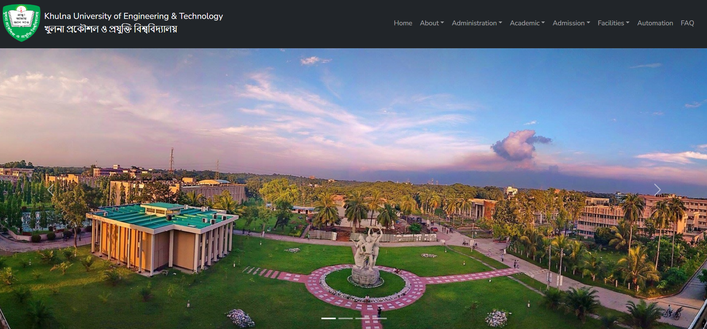
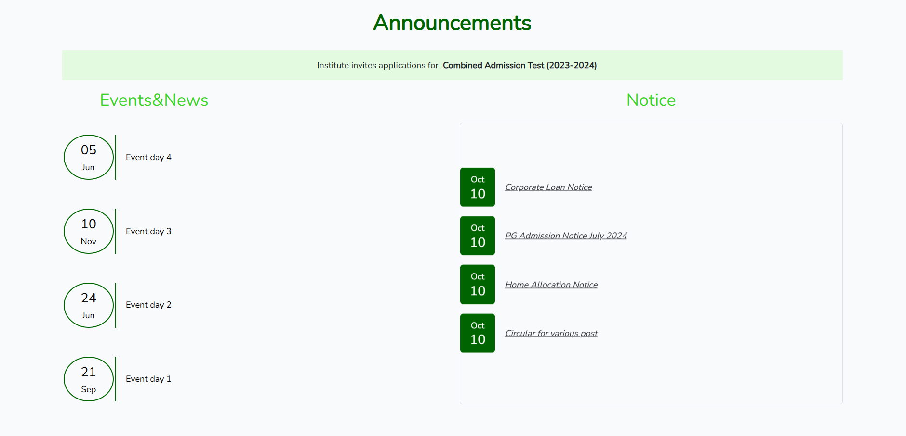
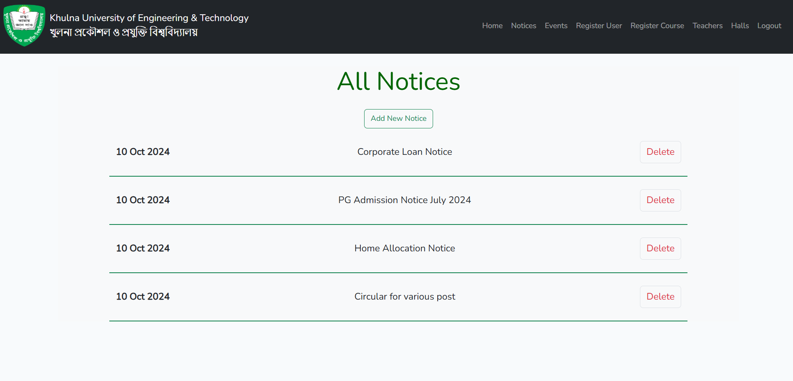
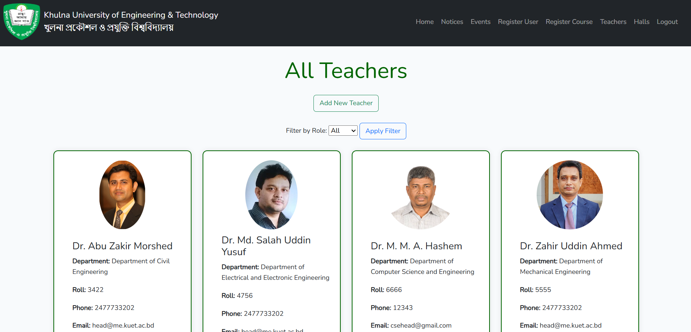
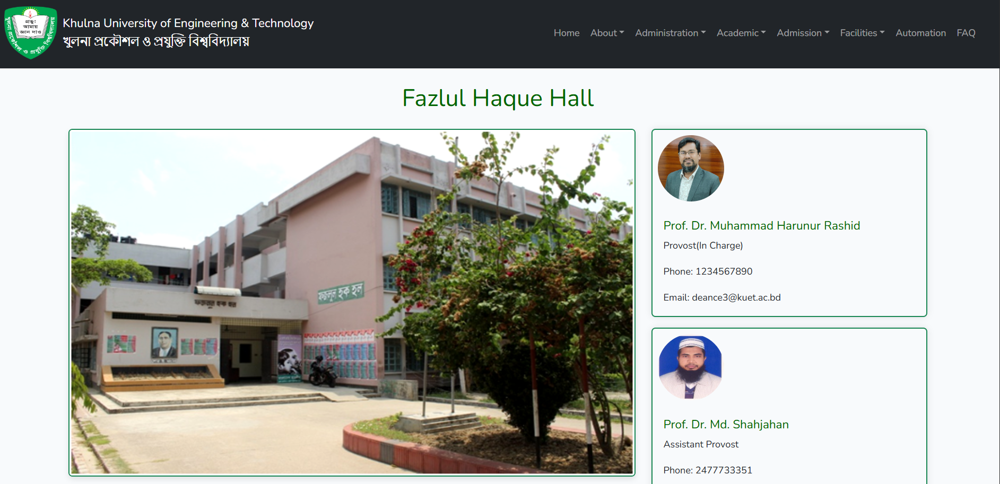
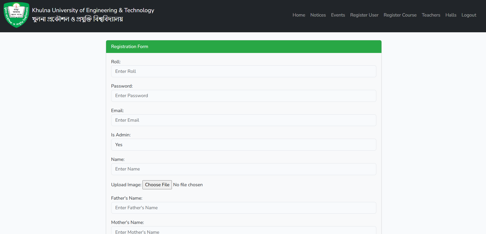
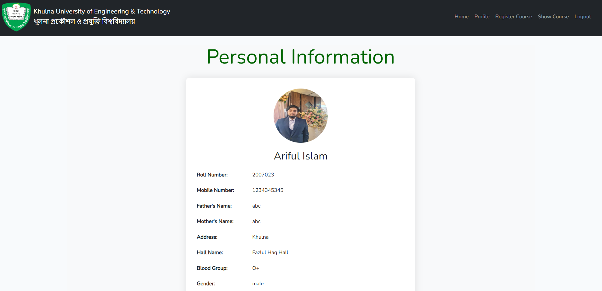
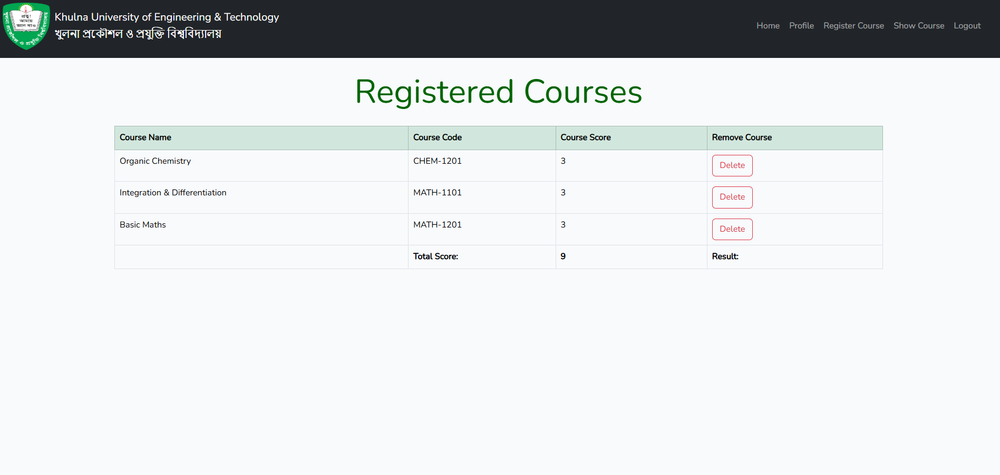

# University Management Website

The University Management System is a dynamic web application developed for my CSE3100 lab, titled "Web Programming." This project utilizes the Laravel framework for back-end development, providing a robust and scalable architecture. The front-end is crafted using Bootstrap, with custom stylizations implemented to enhance the user experience. The application employs MySQL, powered by XAMPP, to manage and store data efficiently.

This system allows users to log in and access functionalities based on their roles as either admin or student. The primary goal of this project is to streamline administrative tasks and improve communication within the university community, ensuring that both students and faculty can easily manage their responsibilities.

[Watch Project Demo Vidoe on Youtube](https://youtu.be/IlTU8NBjhkI)

# Features

1. **<u>User Authentication:</u>** Users can log in with their credentials, ensuring secure access to the application.
2. **<u>Role-Based Access Control:</u>** The system differentiates between admin and student roles, directing users to appropriate pages based on their roles.
    - **Admin Features:**
        - Notice Management: Admins can create, update, and delete notices to keep students informed.
        - Event Management: Admins can add and manage events happening within the university.
        - Course Management: Admins can add, update, and delete courses for different departments, as well as assign teachers to these courses.
        - Faculty Management: Admins have the ability to add and update information about faculty members, add new members, change roles such as head, dean
        - Hall Management: Admins can add details about university halls, including descriptions and images.
    - **Student Features:**
        - Information Update: Students can update their personal information, ensuring that their details are current.
        - Course Selection: Students can browse and select courses they wish to attend, enhancing their academic experience.

# Snapshots

<table>
  <tr>
    <td align="center">
      
       
      <em>Figure 1: Home Page</em>
    </td>
    <td align="center">
      
       
      <em>Figure 2: Dynamic Events & Notices</em>
    </td>
  </tr>
    <tr>
    <td align="center">
      
       
      <em>Figure 3: Add Events</em>
    </td>
    <td align="center">
      
       
      <em>Figure 4: Add, Assign, Update Teachers</em>
    </td>
  </tr>
    <tr>
    <td align="center">
      
       
      <em>Figure 5: Hall Managment</em>
    </td>
        <td align="center">
      
       
      <em>Figure 6: Add New Student</em>
    </td>

  </tr>
    <tr>
        <td align="center">
      
       
      <em>Figure 7: Student Profile</em>
    </td>
    <td align="center">
      
       
      <em>Figure 8: Courses Taken</em>
    </td>
  </tr>
</table>

# Tools Used

-   **Laravel**: A powerful PHP framework for building web applications.
-   **Bootstrap**: A front-end framework for responsive design, customized for this project.
-   **XAMPP**: A local development environment for PHP applications.
-   **MySQL**: The database management system for storing application data.
-   **Composer**: Dependency manager for PHP, used to manage Laravel libraries.
-   **GitHub**: Version control platform for collaboration and code management.

# LICENSE

[MIT LICENSE](LICENSE)
